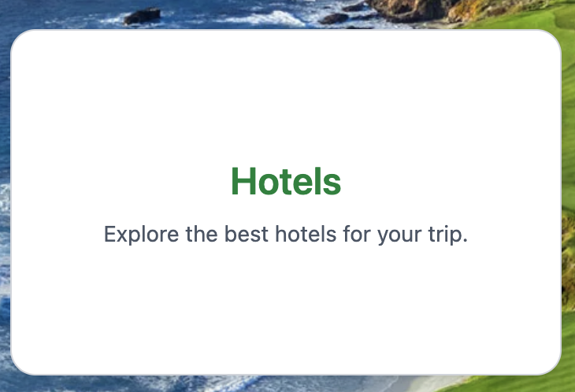
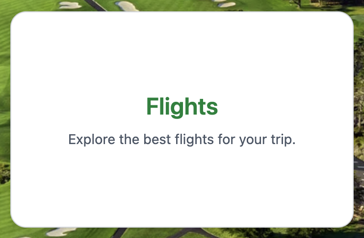
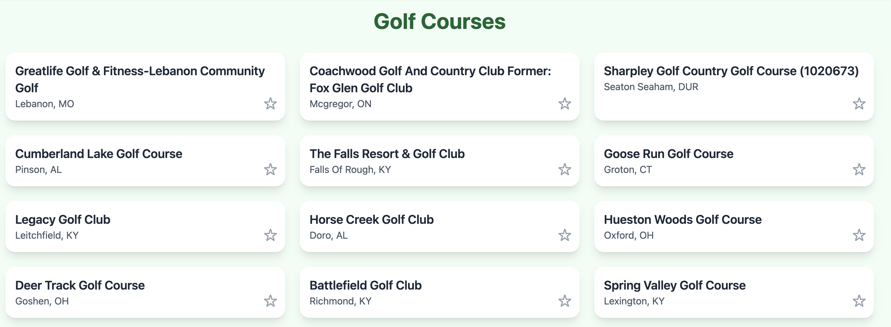

# Tee Box

Tee Box is a travel app that allows users to book golf trip "packages"--course, hotel, and flight reservations simultaneously. All of the app's features are displayed on the homepage (even those that are still under construction).

## Usage

Tee Box is intended to be accessed via the web browser--it is optimized for both desktop and mobile environments. The navigation bar at the top includes an optional dark mode.

Personal account and geocentric search functionality will be added at a later date (a placeholder exists on the frontend right to the navigation bar).

Users can assemble course, hotel, and flight packages, or search for courses, hotels, or flights individually. A card for each category is located on the landing page.

Currently, the golf course page is the only part of the frontend that is both functional and connected to an API. Users will eventually be able to favorite courses, hotels, and flights, which is how users form custom packages.

The hotel and flight pages are under construction at the time of writing this.

## Contributing

Contributions welcome.

## Authorship

By Morgan, Xavier, Nick, and Logan. Additional code sourced from ChatGPT.

## License

[MIT](https://choosealicense.com/licenses/mit/)
